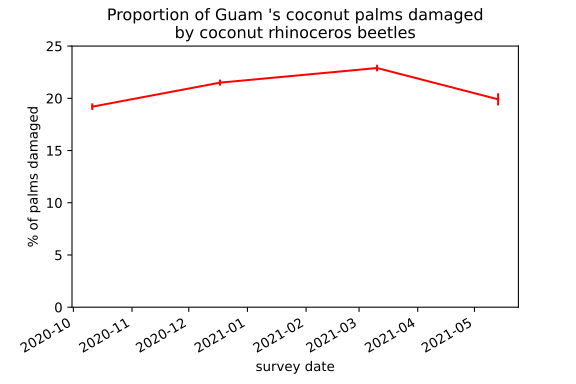
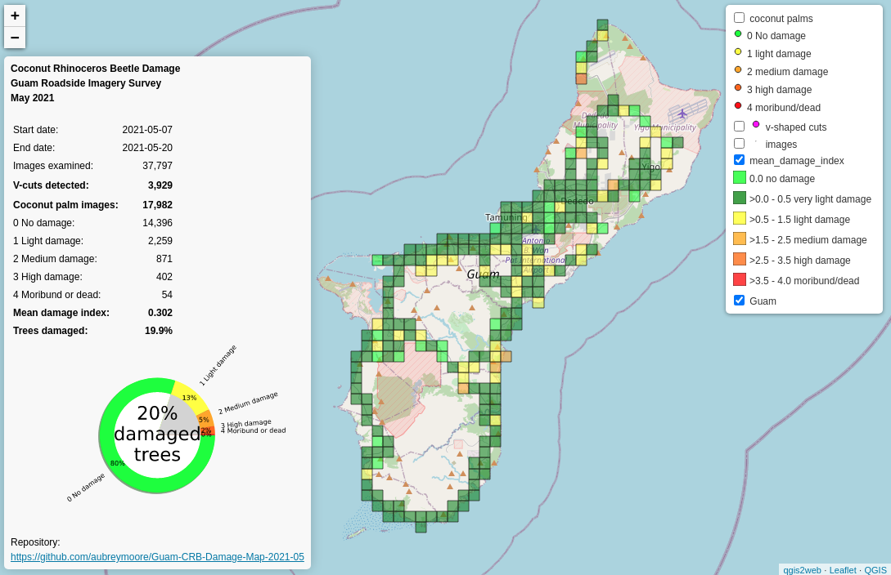

# PRESS RELEASE

Prepared by Aubrey Moore, May 23, 2021

## Bimonthly island-wide roadside image surveys indicate that one in five coconut palms on Guam show signs of attack by coconut rhinoceros beetles (CRB). 



CRB damage surveys on Guam use an innovative method developed by UOG entomologist Dr. Aubrey Moore. High definition digital images are recorded along roadsides of all major routes at a rate of one per second by a smart phone attached to a vehicle. Back in the lab, a computer program developed using an artificial intelligence technique called *deep learning* examines every image, finds all coconut palms, measures CRB damage to each palm, and generates an interactive map which is published on the internet.



**Screen capture of an online interactive map of coconut rhinoceros beetle damage on Guam. <https://aubreymoore.github.io/Guam-CRBDamage-Map-2021-05/webmap>**

Moore says the new damage survey method is a big improvement over the standard CRB damage monitoring method which requires visual inspection and assessment of individual palms: “We can now quickly measure damage to tens of thousands of palms instead of a few hundred. This means that our damage estimates are much more precise. The data will be used to measure changes in damage in response to CRB pest control activities.”

Moore’s work on monitoring CRB damage on Guam is supported by grants from the US Department of the Interior – Office of Insular Affairs and the US Forest Service.

**Contact for further information:**
```
Dr. Aubrey Moore
Entomologist
College of Natural and Applied Sciences
University of Guam

email: aubreymoore@triton.uog.edu
Cell: 1-671-686-5664
```
 
